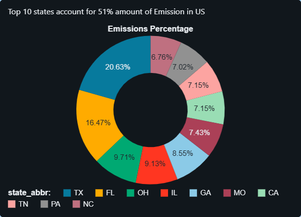

# US Emissions Analysis (2023)


End-to-end emissions analysis using Databricks SQL on the EPA 2023 county-level dataset. The project maps geographic emissions patterns, calculates per-capita normalization, aggregates to the state level, and identifies how a small number of states account for the majority of US greenhouse gas output.

---

## Problem Statement

Greenhouse gas emissions are one of the most pressing environmental and policy challenges of our time. Regulatory agencies, environmental organizations, and corporate compliance teams all need reliable, granular data to:

- Set meaningful state-level reduction targets backed by evidence
- Allocate enforcement resources to the highest-impact regions
- Compare states fairly — a state with a large population naturally emits more in absolute terms, so raw totals alone are misleading
- Monitor progress toward national climate commitments year-over-year

Without structured data analysis, emissions reporting remains a collection of raw numbers rather than actionable intelligence. This project transforms the EPA 2023 county-level dataset into clear, queryable insights that answer: *Which states are the biggest contributors, and how concentrated is the problem?*

---

## Business Value

State-level emissions insights derived from this analysis directly support:

- **Regulatory strategy**: Policymakers can prioritize states where targeted interventions will have the largest national impact. If the top 10 states account for over 50% of total US emissions, reducing emissions in those states yields outsized national returns.
- **Fair comparison across states**: Per-capita normalization removes population bias, exposing states where industrial activity or energy mix — not just sheer size — drives high emissions.
- **Concentration analysis**: Understanding what share of national emissions comes from the top N states informs whether a broad national policy or a targeted regional approach is more efficient.
- **Dashboard-driven reporting**: Interactive Databricks dashboards translate raw SQL results into executive-ready visuals that support quarterly reviews and compliance reporting workflows.

---

## Data Architecture

### Data Source

The dataset is the **EPA 2023 county-level emissions file** (`data/Emissions_Data_2023.csv`). Each row represents one US county and includes:

| Field | Description |
|---|---|
| `state_id` / `state_abbr` | State identifier and two-letter abbreviation |
| `county_state_name` / `county_name` | Full county label |
| `latitude` / `longitude` | Geographic centroid for map plotting |
| `population` | County population (comma-formatted string) |
| `GHG emissions mtons CO2e` | Greenhouse gas emissions in metric tons of CO₂ equivalent (comma-formatted string) |

Additional columns cover electricity consumption, natural gas usage, vehicle miles traveled, and commercial building data — providing context for emissions sources.

### Data Ingestion into Databricks

The CSV is loaded directly into a Databricks lakehouse table (`emissions_data`) via the **Databricks File Upload** interface or the `COPY INTO` command. Because the numeric fields (`population`, `GHG emissions mtons CO2e`) use comma-formatted strings, all queries cast them at query time:

```sql
CAST(REPLACE(`GHG emissions mtons CO2e`, ',', '') AS DOUBLE)
```

This avoids schema-level type conflicts while keeping the source file unchanged.

### Data Quality Checks

- **Null guard on population**: The per-capita query uses `NULLIF(..., 0)` to prevent division-by-zero errors for unpopulated or zero-population records.
- **String-to-numeric casting**: Consistent `REPLACE` + `CAST` pattern across all queries ensures uniform numeric handling.
- **Aggregation validation**: State totals are cross-checked against the national total via a CTE (`totals`) to confirm percentages sum to 100%.

---

## Analysis Methodology

### Geographic Mapping

`sql_queries/1. location_mapping.sql` selects each county's `latitude`, `longitude`, and emissions value. Databricks renders these three columns as a scatter map, placing a point at each county centroid sized or colored by emissions magnitude — giving an immediate visual of regional hot spots without any GIS preprocessing.

### Per-Capita Normalization

`sql_queries/2. emissions_per_person.sql` calculates:

```
Emissions per Person = GHG emissions (mtons CO2e) / Population
```

Per-capita normalization is essential for fair state comparison. A state like Texas has large absolute emissions partly because it has the second-largest population. Per-capita figures isolate the emissions intensity driven by industrial mix, energy sources, and land use rather than population alone.

### State-Level Aggregation

`sql_queries/3. state_totals.sql` uses `GROUP BY state_abbr` with `SUM()` to roll county-level data up to the state level. The result is sorted descending to surface the top-10 highest-emitting states immediately.

### CTE-Based Concentration Analysis

`sql_queries/4. top_10_percentage.sql` (and `analysis.sql`) chains four CTEs:

1. **`state_emissions`** — aggregates all counties to state totals
2. **`top10`** — selects the 10 highest-emitting states
3. **`totals`** — computes the national grand total
4. **`top10_sum`** — sums only the top-10 states

A final `CROSS JOIN` between these CTEs produces the concentration ratio: what percentage of national emissions the top 10 states collectively represent. CTEs improve readability and allow Databricks to optimize each logical step independently.

---

## Key Findings

- **Emissions are highly concentrated**: A small number of states contribute over **50% of total US greenhouse gas emissions**, confirming that targeted regional policy can have outsized national impact.
- **Top emitting states by absolute emissions** are dominated by large industrial and energy-producing states — driven by fossil fuel extraction, heavy manufacturing, and large power generation fleets.
- **Per-capita analysis reveals a different picture**: Several smaller or mid-size states rank much higher on a per-person basis, exposing emissions intensity driven by industry mix rather than population.
- **County-level geographic mapping** shows distinct spatial clustering — emissions hot spots are concentrated in energy corridors and industrial regions rather than distributed uniformly across the country.

---

## Technical Deep Dive

### SQL Queries

| File | Technique | Purpose |
|---|---|---|
| `1. location_mapping.sql` | Simple `SELECT` with coordinate columns | Feed lat/long/emissions into map visualization |
| `2. emissions_per_person.sql` | `CAST`, `REPLACE`, `NULLIF`, division | Per-capita normalization with null safety |
| `3. state_totals.sql` | `GROUP BY` + `SUM` + `ORDER BY` | State-level rollup, top 10 by absolute emissions |
| `4. top_10_percentage.sql` | 4-CTE chain + `CROSS JOIN` | Concentration ratio for top-10 states |
| `5. top_counties_by_emissions.sql` | `ORDER BY … DESC LIMIT 10` | Highest-emitting individual counties |

### Databricks Dashboard Creation

Each SQL query is saved as a **named query** in the Databricks SQL Editor. Dashboards are built by:

1. Adding a query result as a **visualization** (map, bar chart, or table)
2. Configuring axis labels, color scales, and titles in the visualization editor
3. Pinning multiple visualizations to a single **dashboard canvas**
4. Publishing the dashboard for sharing via a URL or scheduled refresh

The exported dashboard configuration is stored in `dashboards/Emissions Dashboard.lvdash.json` for version control and reproducibility.

### Performance Optimization

- **CTE reuse**: Intermediate aggregations (e.g., `state_emissions`) are defined once and referenced by multiple downstream CTEs, avoiding redundant full-table scans.
- **Early filtering with `LIMIT`**: Top-N queries apply `LIMIT` inside CTEs before joining, reducing the rows passed to `CROSS JOIN` operations.
- **String casting at query time**: Rather than storing pre-cast columns, casting is done inline so the raw CSV schema stays clean and flexible for other query patterns.

---

## Dashboard Metrics Explained

| Dashboard Panel | What It Shows | How to Interpret |
|---|---|---|
| **Emissions per Location** | County-level scatter map (lat/long) colored by emissions | Spatial clusters indicate regional industrial concentration |
| **Emissions vs Population** | Scatter plot of state population vs total emissions | States above the trend line emit more than their population size would predict |
| **Total Emissions by mTon CO2e** | Bar chart of top states by absolute emissions | Identifies which states need the most direct regulatory attention |
| **Visualization** | Combined summary dashboard | High-level executive overview combining map and ranking views |

The concentration ratio — shown as a percentage — is the single most actionable metric: it tells decision-makers what share of the national problem can be addressed by focusing on a handful of states.

---

## Dashboards




---

## Reproducibility

### Step 1 — Load the CSV into Databricks

1. In your Databricks workspace, go to **Catalog → Add Data → Upload Files**.
2. Upload `data/Emissions_Data_2023.csv` and name the table `emissions_data`.
3. Confirm the schema preview shows the expected columns (`state_abbr`, `latitude`, `longitude`, `population`, `GHG emissions mtons CO2e`, etc.).

### Step 2 — Run the SQL Queries

Open the Databricks SQL Editor and run each file in order:

```sql
-- 1. Map visualization data
SELECT latitude, longitude, `GHG emissions mtons CO2e` AS Emissions
FROM emissions_data;

-- 2. Per-capita emissions (top 10 counties)
SELECT county_state_name, population,
       CAST(REPLACE(`GHG emissions mtons CO2e`, ',', '') AS DOUBLE)
       / NULLIF(CAST(REPLACE(population, ',', '') AS DOUBLE), 0) AS Emission_per_person
FROM emissions_data
ORDER BY Emission_per_person DESC
LIMIT 10;

-- 3. State totals
SELECT state_abbr,
       SUM(CAST(REPLACE(`GHG emissions mtons CO2e`, ',', '') AS DOUBLE)) AS Total_Emissions
FROM emissions_data
GROUP BY state_abbr
ORDER BY Total_Emissions DESC
LIMIT 10;

-- 4. Concentration ratio — what % of national emissions comes from the top 10 states
WITH state_emissions AS (
  SELECT state_abbr,
         SUM(CAST(REPLACE(`GHG emissions mtons CO2e`, ',', '') AS DOUBLE)) AS total_emissions
  FROM emissions_data
  GROUP BY state_abbr
),
top10 AS (
  SELECT state_abbr, total_emissions
  FROM state_emissions
  ORDER BY total_emissions DESC
  LIMIT 10
),
totals AS (
  SELECT SUM(total_emissions) AS national_total
  FROM state_emissions
),
top10_sum AS (
  SELECT SUM(total_emissions) AS top10_total
  FROM top10
)
SELECT t.state_abbr,
       t.total_emissions,
       ROUND(100.0 * s.top10_total / tot.national_total, 2) AS top10_percentage_of_national
FROM top10 t
CROSS JOIN top10_sum s
CROSS JOIN totals tot
ORDER BY t.total_emissions DESC;
```

### Step 3 — Recreate the Dashboards

1. Save each query result as a named visualization in Databricks SQL.
2. Create a new **Dashboard** and add each visualization as a panel.
3. For the map panel, select **Map** as the visualization type with `latitude` and `longitude` as the coordinate fields.
4. Optionally import `dashboards/Emissions Dashboard.lvdash.json` directly if your workspace supports dashboard import.

---

## Skills Demonstrated

**Data Analytics** · **Databricks** · **SQL** · **Data Visualization** · **ETL** · **Environmental Data** · **CTE Query Design** · **Per-Capita Normalization** · **Geospatial Mapping** · **Dashboard Development**

---

> *This project was completed by following a guided Databricks SQL tutorial and independently implementing the full analysis, query design, and dashboard.*
